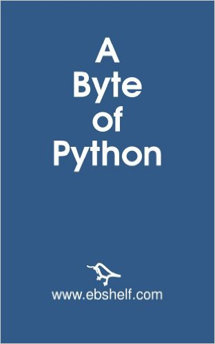

# AByteOfPython

“A Byte of Python” – это свободная книга по программированию на языке Python. Она может служить учебным пособием или руководством по языку Python для начинающей аудитории. Если ваши знания о компьютере ограничиваются тем, как сохранять текстовые файлы, эта книга для вас.

Книга короткая - 150 страниц и рассказывает самые-самые важные аспекты для начала. 

